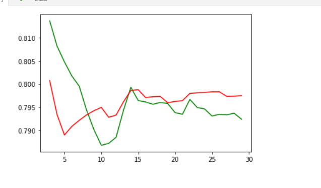

# implement for DGAT
## 朴素GAT
    
    cora: 87.2635, 1.13 
    cite: 76.3597, 1.24 
    cham: 55.3289, 2.35  
训练时长长 收敛慢，反复波动，往往需要训练800epoch以上。
## maxneibor:
    cora:168
    citeseer 99
    chameleon 88

| 实现方法                            | cora             | cite              | cham               |
| ----------------------------------- | ---------------- | ----------------- | ------------------ |
| **mode1**:neigborAtt(QKV)+GCN       | **83.4205, 1.4** | 72.4132, 1.5      | 71.7763, 2.54      |
| **mode2**:neigborAtt(GAT-impl)+GCN  | 82.2535, 1.87    | 72.2222, 1.82     | 69.8903, 2.3       |
| **mode3**:neigborAtt(QKV)+GAT(same) | 83.2193, 2.04    | **72.4410, 1.93** | **72.3903,  1.51** |
| **mode4**:neigborAtt(QKV)+GAT(diff) | 83.2997, 1.69    | 72.2824, 1.18     | 72.1271, 2.22      |
mode3和mode4的区别是neigborGAT和后续的GAT是不是用的同一套QKV参数

## 扩充节点策略
### NeigborAtt+GCN：**每个节点取得最近的10/20/50节点**
最近的定义：利用带重启的随机游走算法对每个节点进行计算权重，取权重最大的认为是最近的。
| 最近的k个节点 | cora             | cite             | cham              |
| ------------- | ---------------- | ---------------- | ----------------- |
| 0             | **83.4205, 1.4** | **72.4132, 1.5** | **71.7763, 2.54** |
| 10            | 84.3661, 0.84    | 72.1172, 1.36    | 34.5614, 2.62     |
| 20            | 83.4607, 1.04    | 70.5149, 1.68    | 32.5438, 2.47     |
| 50            | 83.7223, 1.31    | 67.9024, 3.18    | 31.7324, 2.01     |

特点: 所用时间少。

解释：对于chameleon数据的影响很大，是由于chameleon数据集很多类的数量本身就不多
### NeigborAtt+GCN 扩展：**2hop**
训练用时太长，难以跑完
cham：(52.85+62.06+58.33)=**57.74**
### NeigborAtt+GCN 对邻居少的采用2hop，其他采用1hop
   | 对于邻居节点少于 | cham              |
   | ---------------- | ----------------- |
   | 0                | **71.7763, 2.54** |
   | 5                | 69.8684, 2.52     |
   | 10               | 67.9825, 2.44     |
   | 20               | 61.4035, 2.83     |
 
### NeigborAtt+GAT **对邻居少的采用2hop，其他采用1hop**
| 对于邻居节点少于 | cham              |
| ---------------- | ----------------- |
| 0                | 72.1271, 2.22     |
| 2                | 71.5351, 1.63     |
| 3                | **72.6974, 1.89** |
| 4                | 72.3465, 2.01     |
| 5                | 71.6447, 2.13     |
| 10               | 68.7939, 2.15     |
| 20               | 64.9781, 1.88     |

### **deepwallk 和rwr 增补法**
利用每个向量进行deepwalk训练出的embeding向量点积，计算在结构上相似的点添加到点的邻居中。同时也考虑，每一个点经历过rwr后的向量。

**deepwalk更倾向表示在图新结构上的相似程度**

**rwr更倾向表示距离中心点的距离**

对低度数节点进行增补，当度数少于limits，**保留在deepwalk视角下最近的A个节点和在rwr视角最近的B个节点。**

| limits | A   | B   | 效果             |
| ------ | --- | --- | ---------------- |
| 0      | 0   | 0   | 72.1271, 2.22    |
| 4      | 4   | 4   | **72.4342, 1.7** |
| 4      | 0   | 10  | 70.5482, 3.14    |
| 4      | 10  | 0   | 71.9737, 1.64    |
| 4      | 10  | 0   | 69.2544, 1.27    |
| 4      | 10  | 0   | 65.4167, 2.28    |

然后我看看**对于GAT来说**，这种对低度数节点进行按照临近或图形结构增补分方法有没有效果。

考虑运行时间，只跑了5次切分的数据

| limits | A   | B   | cora              | cite              | cham              |
| ------ | --- | --- | ----------------- | ----------------- | ----------------- |
| 0      | 0   | 0   | **87.2635, 1.13** | **76.3597, 1.24** | 55.3289, 2.35     |
| 4      | 4   | 4   | 86.1971, 1.2      | 69.3627, 4.3      | **55.4385, 2.19** |
| 4      | 0   | 10  |                   |                   | 54.6052, 2.87     |
| 4      | 0   | 4   | 86.5593, 1.73     | 72.6059, 2.72     |
| 4      | 4   | 0   | 85.8752, 1.51     | 70.3579, 3.93     |                   |

# 实验探究：
## 假设：低度数节点更容易错判，所以加边有效 **错误**
实验指标：

    错误节点的平均度数，所有节点的平均度数=19.4753,16.8253

    错误节点中度数小于等于3的比例：正确……=0.1823, 0.1431

度数包括自身

**得到结论，在chameleon中节点度数低和效果差之间没有平均意义上的联系**
## 在deepwalk的排名中，随着排名的靠前，对应的边越可能是类内边 **错误**
X轴是考虑deepwalk排名前x的点（除自己以外）

Y轴是类内边占据的比例

绿色表示在错误点集中

红色表示所有点集中

**得到结论，在chameleon中deepwalk的排名靠前和此邻居是类内边没有显著关系**
## 在rwr的排名中，随着排名的靠前，对应的边越可能是类内边
X轴是考虑rwr排名前x的点（除自己以外）

Y轴是类内边占据的比例

绿色表示在错误点集中

红色表示所有点集中

**得到结论，在chameleon中rwr的排名靠前和此邻居是类内边没有显著关系，所以2hop可能得不到很好的结果**

# 目前存疑的点
1. neigborAtt加GAT|GCN为什么在效果上差不多
2. 还有没有可能有更好的加边的方法
# 可以改进的地方
1. 更改实现方法
2. 优化加边的方案